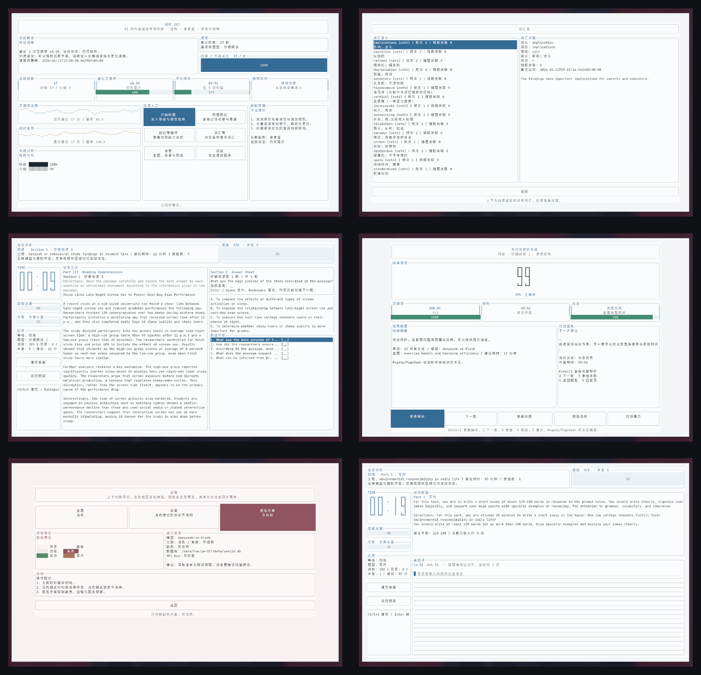
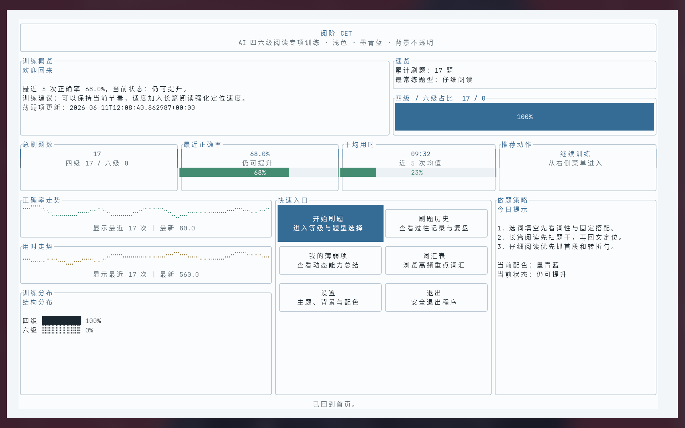
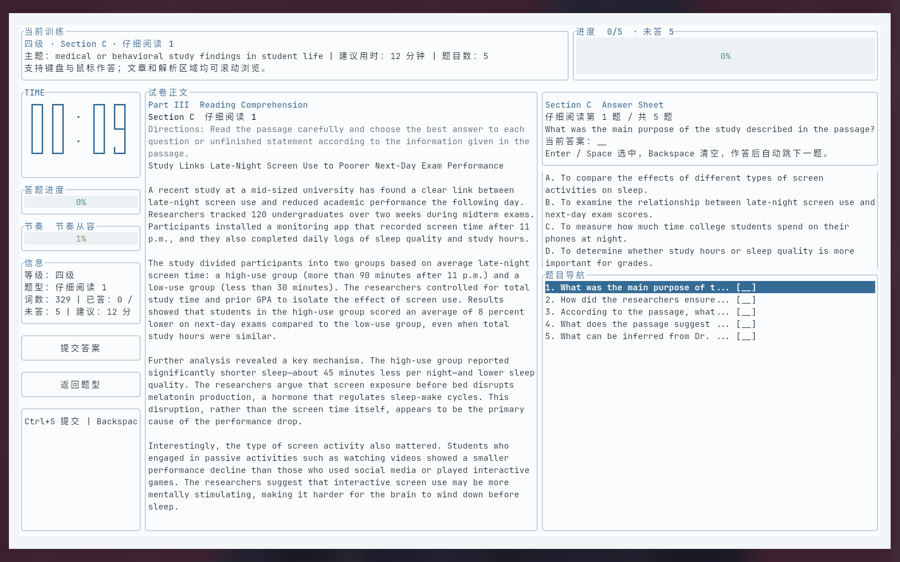
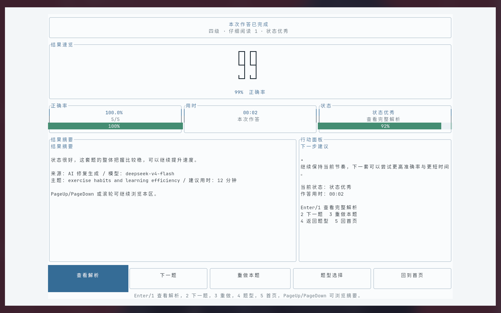
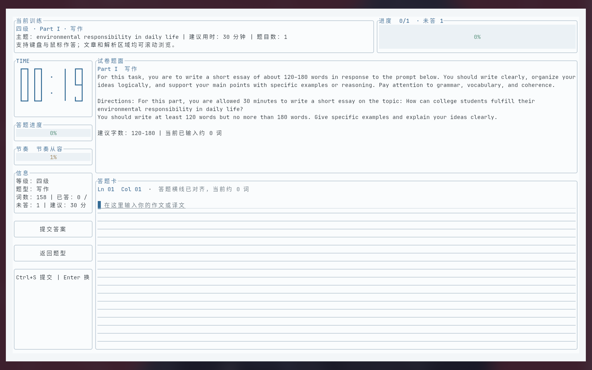
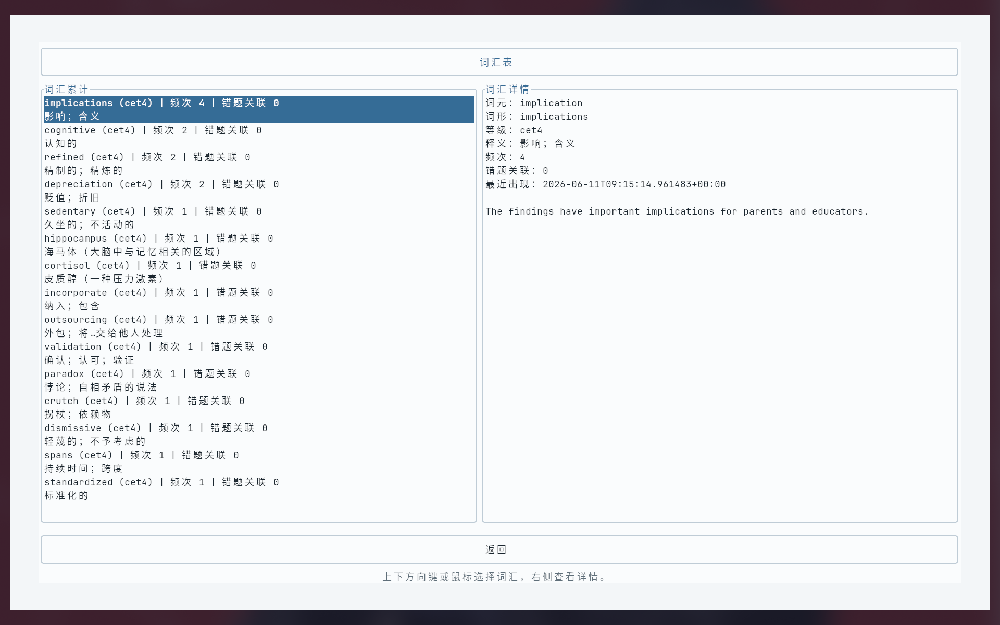
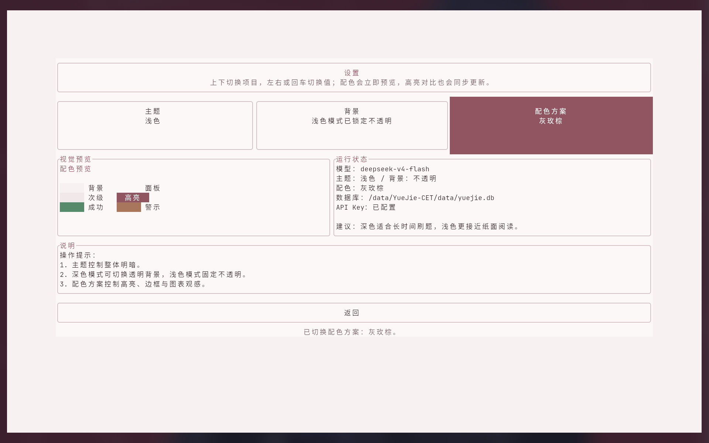

# 阅阶 CET

<p align="center">
  
  
  
  
  
</p>

> 面向大学英语四级 / 六级（CET-4 / CET-6）的 AI 驱动 TUI 刷题工具  
> Rust 负责终端交互与动画，Python 负责 DeepSeek 出题、评分、校验与数据闭环

`阅阶 CET` 不是简单的终端题库，而是一个围绕 CET 真题风格训练设计的完整练习系统：

- 进入首页即可看到刷题统计、趋势图、词汇与薄弱项概览
- 选择四级 / 六级与题型后，由 AI 依据 CET 风格约束生成题目
- 支持阅读、写作、翻译三大方向，覆盖客观题与主观题
- 作答结束后提供结果页、完整复盘、词汇整理与动态薄弱项总结
- 历史记录可重做、删除，并自动重算统计、词汇与薄弱项

项目默认体验以 **Rust TUI 前端** 为主，目标是提供接近“试卷 + 答题卡”感受的终端学习体验。

> 声明：本项目为基于 AI 的 CET 风格训练工具，目标是生成 **符合四/六级结构与难度偏好的练习题**，并不代表官方真题或官方阅卷系统。

## 目录

- [项目预览](#项目预览)
- [核心亮点](#核心亮点)
- [支持题型](#支持题型)
- [功能概览](#功能概览)
- [技术架构](#技术架构)
- [快速开始](#快速开始)
- [配置说明](#配置说明)
- [使用流程](#使用流程)
- [开发与验证](#开发与验证)
- [目录结构](#目录结构)
- [当前状态与边界](#当前状态与边界)

## 项目预览

### 总览

<p align="center">
  
</p>

### 典型页面

| 首页总览 | 阅读作答 |
| --- | --- |
|  |  |
| 统计、趋势、最近表现、快速入口 | 试卷正文、题目区、电子表计时与操作栏 |

| 结果页 | 写作作答 |
| --- | --- |
|  |  |
| 居中结果卡片、下一步操作、复盘入口 | 两列写作布局、答题横线、词数与光标信息 |

| 词汇 / 历史类页面 | 设置页 |
| --- | --- |
|  |  |
| 持久化词汇累计、可回看来源与释义 | 主题、背景与配色方案切换 |

更多截图可见 [`screenshot/`](./screenshot/)。

## 核心亮点

- **真题风格出题**  
  不是随机拼凑文本，而是按 CET 题型结构、字数区间、题目数量、风格偏好和题干问法做约束生成。

- **Rust TUI + Python AI 双层架构**  
  Rust 负责流畅交互、鼠标键盘输入、布局、动画与结果展示；Python 负责调用 DeepSeek、执行结构校验、评分与持久化。

- **主观题完整评阅链路**  
  写作 / 翻译不仅给分，还会给出：
  - 分项评分
  - 错词纠正
  - 病句改写
  - 逐句批注
  - 高分范文 / 参考译文

- **客观题与主观题统一闭环**  
  历史、词汇、薄弱项、近期趋势、最近正确率 / 用时都汇总在同一套数据体系里。

- **失败可重试的 AI 工作流**  
  出题或评分失败时不会直接把用户踢回上一级，而是保留当前流程页并支持原地重试。

- **可持续刷题的数据系统**  
  删除历史记录后，相关统计、词汇表和薄弱项会一起重算，避免脏数据残留。

## 支持题型

### 阅读

| 模块 | 题型 | 说明 |
| --- | --- | --- |
| `Section A` | 选词填空 | 10 空 + 15 共享选项，强调词性、搭配与语境 |
| `Section B` | 长篇阅读 | 段落匹配，强调同义改写与定位能力 |
| `Section C` | 仔细阅读 1 | 更偏事实驱动、实验 / 研究 / 结果对应 |
| `Section D` | 仔细阅读 2 | 更偏观点驱动、推断 / 态度 / 例证目的 |

### 主观题

| 模块 | 题型 | 说明 |
| --- | --- | --- |
| `Part I` | 写作 | CET 风格短文写作，按字数与评分维度约束生成 |
| `Part IV` | 翻译 | 中文到英文翻译，按中文原文长度与评分维度约束生成 |

## 功能概览

### 训练与作答

- 四级 / 六级切换
- 键盘 + 鼠标混合作答
- 阅读三列布局，写作 / 翻译两列布局
- 大字电子表风格计时器
- AI 出题中 / 评分中动画与阶段提示
- 结果页与复盘页分离，先看结果，再看完整解析

### 结果与复盘

- 客观题正确率、用时、逐题解析
- 主观题分数、分项反馈、逐句批注
- 错词纠正与病句改写
- 高分范文 / 参考译文
- 重点词汇提取与累计

### 数据与成长

- 首页训练总览
- 最近正确率与最近平均用时趋势
- 题型级统计
- 历史记录回看、重做、删除
- 动态薄弱项总结
- 高频重点词汇表

### 外观与交互

- 深色 / 浅色主题
- 多套配色方案
- 深色模式可切换透明 / 不透明背景
- 面向终端场景优化的试卷式布局

## 技术架构

```text
Rust TUI (ratatui/crossterm)
        │
        │ JSON CLI bridge
        ▼
Python bridge.py / services
        │
        ├─ DeepSeek client
        ├─ Prompt & pipeline
        ├─ CET validator
        ├─ Scoring / review
        └─ SQLite persistence
```

### 角色划分

- **Rust 前端**
  - 页面布局
  - 键鼠事件处理
  - 动画与状态机
  - 作答过程与结果展示

- **Python 后端**
  - DeepSeek 调用
  - 严格 JSON 结构校验
  - CET 题型约束修复与重试
  - 客观题判分
  - 主观题评阅
  - SQLite 数据落库

### 主要技术栈

- 前端：Rust + `ratatui` + `crossterm`
- AI / 业务层：Python 3.12+
- 数据存储：SQLite
- 模型：DeepSeek（默认 `deepseek-v4-flash`，可配置）

## 快速开始

### 1. 环境要求

- Python `3.12+`
- Rust 稳定版工具链
- 可访问 DeepSeek API 的网络环境

### 2. 安装依赖

```bash
cd /data/YueJie-CET
python -m venv .venv
source .venv/bin/activate
pip install -e .
cp .env.example .env
cargo build --release
```

### 3. 配置 API

编辑 `.env`：

```dotenv
DEEPSEEK_API_KEY=
DEEPSEEK_BASE_URL=https://api.deepseek.com
DEEPSEEK_MODEL=deepseek-v4-flash
YUEJIE_DB_PATH=
YUEJIE_REQUEST_TIMEOUT=120
```

### 4. 启动

```bash
source .venv/bin/activate
yuejie-cet
```

启动逻辑：

1. 优先寻找 Rust 前端二进制
2. 如果存在：
   - `target/release/yuejie-cet-rs`
   - `target/debug/yuejie-cet-rs`
   则自动启动较新的一个
3. 如果尚未找到可执行文件，则尝试在仓库根目录调用 `cargo run --release`
4. 如果当前环境既没有已编译的二进制，也无法调用 Cargo，则提示先执行 `cargo build --release`

## 配置说明

| 变量 | 是否必填 | 默认值 | 说明 |
| --- | --- | --- | --- |
| `DEEPSEEK_API_KEY` | 是 | 空 | 未配置时拒绝真实 AI 出题与评阅 |
| `DEEPSEEK_BASE_URL` | 否 | `https://api.deepseek.com` | DeepSeek API 地址 |
| `DEEPSEEK_MODEL` | 否 | `deepseek-v4-flash` | 可自行切换到其他 DeepSeek 模型 |
| `YUEJIE_DB_PATH` | 否 | `data/yuejie.db` | SQLite 数据库路径 |
| `YUEJIE_REQUEST_TIMEOUT` | 否 | `120` | API 超时秒数 |

说明：

- `.env` 已被 `.gitignore` 忽略，不会进入版本库
- 题目生成与主观题评分都依赖可用的 DeepSeek API

## 使用流程

1. 启动后进入首页，查看训练总览与最近表现
2. 选择四级或六级
3. 选择题型
4. 等待 AI 生成题目
5. 在 TUI 中作答
6. 提交后先看结果页
7. 再进入复盘页查看完整解析与批注
8. 在历史中继续重做、删除、回顾

### 阅读页布局

- 左侧：计时器、进度、节奏、菜单
- 中间：文章正文
- 右侧：题目与答题区

### 写作 / 翻译布局

- 左侧：计时器、进度、菜单
- 右侧上方：题面
- 右侧下方：答题卡

## 开发与验证

### 本地测试

```bash
cargo test
python -m unittest discover -s tests -v
```

### 发布版构建

```bash
cargo build --release
```

### 流式调试桥接层

#### 真实出题

```bash
python -u -m app.bridge generate-live --level cet4 --question-type writing
python -u -m app.bridge generate-live --level cet4 --question-type translation
python -u -m app.bridge generate-live --level cet4 --question-type careful_reading --slot 1
```

#### 批量抽样生成

```bash
python -m app.sample_review --level cet4 --question-type all --count 2
```

会在 `data/sample-review/` 下输出：

- 每套题的完整 JSON
- 按题型拆分的摘要 JSON
- 一份总览索引，便于逐类人工 review

#### 提交评分

```bash
python -m app.bridge submit
```

`submit` 从标准输入读取 JSON，结构类似：

```json
{
  "question_set_id": "qs_xxx",
  "started_at": "2026-06-10T17:10:00+08:00",
  "answers": {
    "response_text": "your answer here"
  }
}
```

## 目录结构

```text
src/
  main.rs                  Rust TUI 主前端
app/
  main.py                  启动入口，仅负责拉起 Rust 前端
  bridge.py                Rust <-> Python JSON CLI bridge
  ai/                      DeepSeek 客户端、Prompt、生成与评分流水线
  config.py                .env 加载与运行配置
  constants.py             题型、模型、标签等常量
  data/                    SQLite 初始化与查询
  domain/                  枚举、数据模型、评分结构
  services/                出题、作答、统计、薄弱项服务
tests/                     Python 单元测试
screenshot/                README 与展示用截图
data/                      默认数据库目录
```

## 当前状态与边界

### 已完成

- CET4 / CET6 切换
- 阅读 4 题型
- 写作 / 翻译主观题
- 真实 AI 出题
- 主观题真实 AI 评分
- 历史、词汇、薄弱项闭环
- 历史删除后的重算逻辑
- 多主题、多配色、透明背景等终端 UI 能力

### 当前边界

- 题目由 AI 生成，目标是 **CET 风格 / CET 约束下的高质量练习题**，不是官方原卷复刻
- 出题与评分依赖外部 API，可用性受网络与模型状态影响
- 阅读题生成成功率仍在持续优化中，但不会通过放松 CET 结构标准来“假性提高成功率”
- Python 侧现在只保留 AI、桥接、数据库与评分后端，不再维护单独的 Python TUI

### 适合谁

- 想在终端中高频刷 CET 题的用户
- 想把 AI 出题、评分、复盘做成完整学习产品的开发者
- 希望研究 Rust TUI + Python AI 协作模式的项目实践者

## 路线图

- 继续提升阅读类出题成功率，但保持 CET 校验标准不放松
- 进一步打磨题型级统计、薄弱项可视化与成长图表
- 增加导出、备份与更细粒度的配置能力
- 持续优化真题风格 prompt、局部修复策略与结果页体验

---

如果你希望继续扩展这个项目，比较自然的下一步包括：

- 提升阅读类生成成功率与稳定性
- 增加更多图表和成长分析
- 完善导出 / 备份 / 同步能力
- 打磨更细的真题风格 prompt 与修复策略
